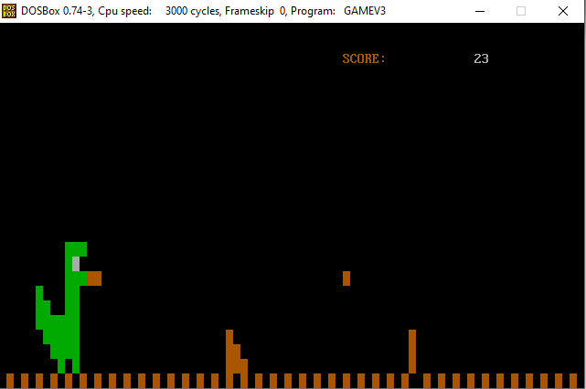
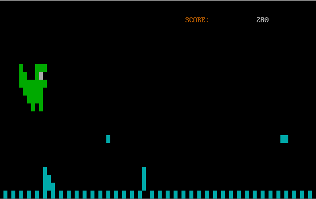

# dinosaur-game-assembly-8086
A simple game made for assembly 8086 where a dinosaur has to dodge obstacles to gain score.

<b>How to Compile ?</b>
    nasm game.asm -o game.com

<b> Run by typing the word 'game' in dosbox </b>

 

